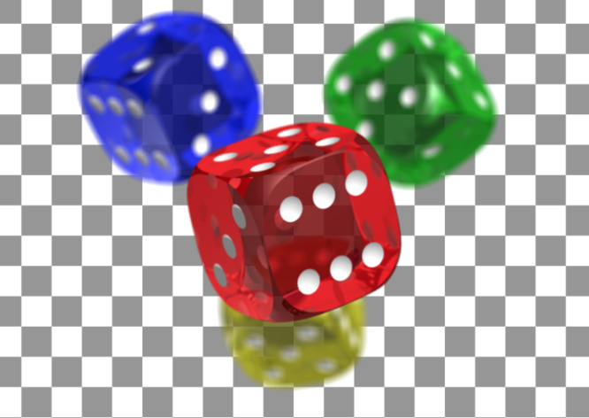
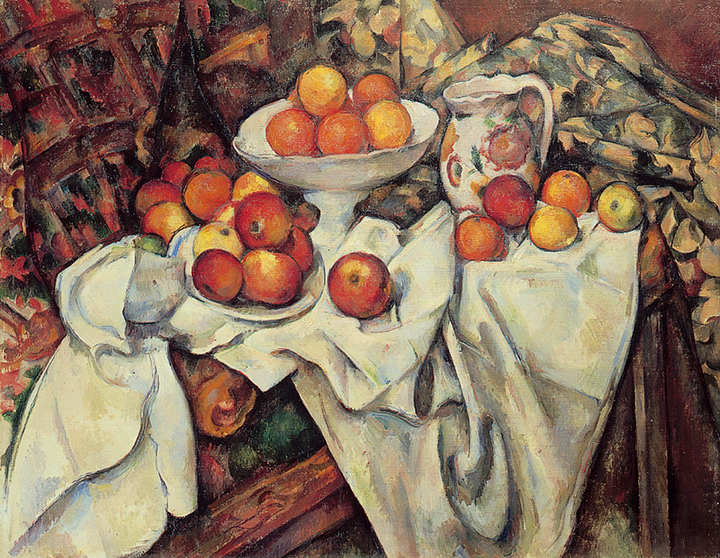
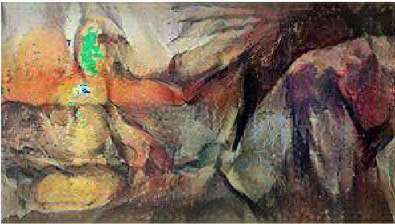

> Using Flutter and Tensorflow, build an image transfer mobile application.

# Main page

Developed by Flutter. 

# Run Server

In `back-end` directory, run servrer.

```bash
$python manage.py runserver
```


# Image Transferring Result

|Style Image     |   Content Image   | Transferred Image|
|:--------------:|:-----------------:|:----------------:|
||||
||||


